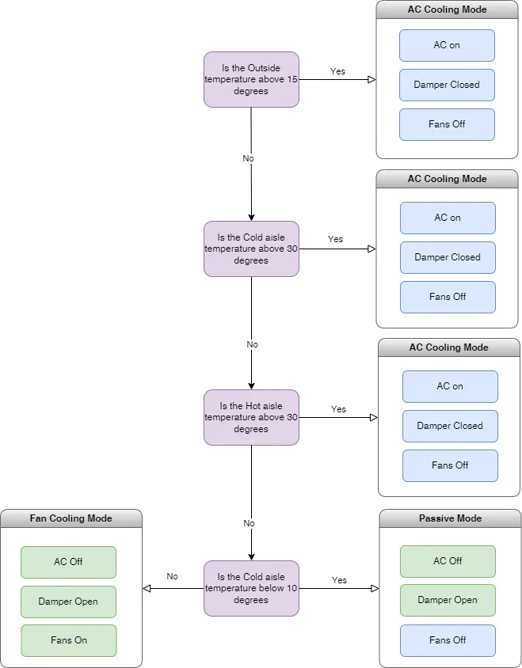

# envirozen
Environmental monitoring and control of a room

### Temperature Control for Server Room

This project was initiated using an Arduino to regulate the server room's temperature. It employs two 1.5Kw fans to introduce external ambient air into the room whenever the temperature falls below the (MAX3) threshold. This process creates a positive pressure inside the room, expelling warmer air through specialized vents. The primary objective is to conserve energy on cooler days by leveraging the ambient air, reducing the reliance on air conditioning units when they're not necessary.

As of October 2023 this will developed into Python for deployment onto a more powerful Rasberry Pi

**Started**: October 2022  
**Reason**: Before the cost of electricity started to rise  
**Author**: Nic Kilby

**Component List**

[Raspberry Pi 4 or better][1] for the central controller

[Enviro Indoor (Pico W Aboard) – Enviro Indoor + Accessory Kit][2] x number of areas to monitor

[Fan 1.5Kw ][3] x 2

[TUNE-S-600x600-M1][4] Mechanical damper with M1 Actuator





**Deploy Enviro Indoor**

Backup up the original main.py first.
Using a program such as Thonny copy main.py and sensor_readings.py from sensors folder on to the root partition.
Edit main.py update values for 

| Parameter |              |
|-----------|-------------------------|
| ssid      | `your_network_name`     |
| password  | `your_password`         |
| location  | `label_for_identification` |


Restart the Pico W and navigate to http://ipaddres/metrics


**Deploy of Raspberry Pi4**

For the controller we are going to use [Ubuntu 22.04 Server][5]. Follow the instructions at this [tutorial][6].
Install NTP
 ```sudo apt install ntp
sudo vim /etc/ntp.conf
sudo systemctl restart ntp ``

We will use snaps to install the [Prometheus][7] server on the Raspberry Pi.


[1]: https://www.raspberrypi.com/products/raspberry-pi-4-model-b/
[2]: https://shop.pimoroni.com/products/enviro-indoor?variant=40055644717139
[3]: https://www.plugandcool.co.uk/product/1-5-grain-store-fan/
[4]: https://www.puravent.co.uk/tune-s-600x600-m1.html
[5]: https://ubuntu.com/download/raspberry-pi
[6]: https://ubuntu.com/tutorials/how-to-install-ubuntu-on-your-raspberry-pi#2-prepare-the-sd-card
[7]: https://snapcraft.io/install/prometheus/raspbian